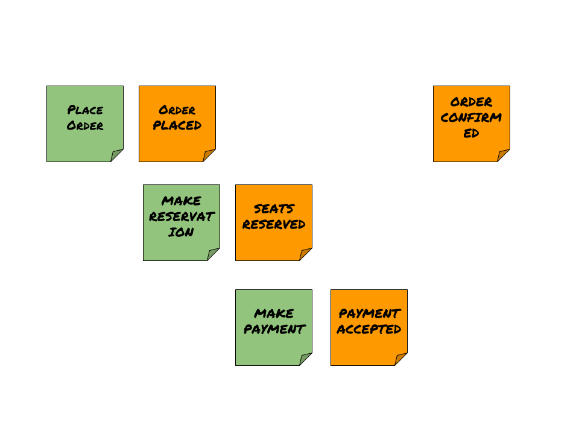
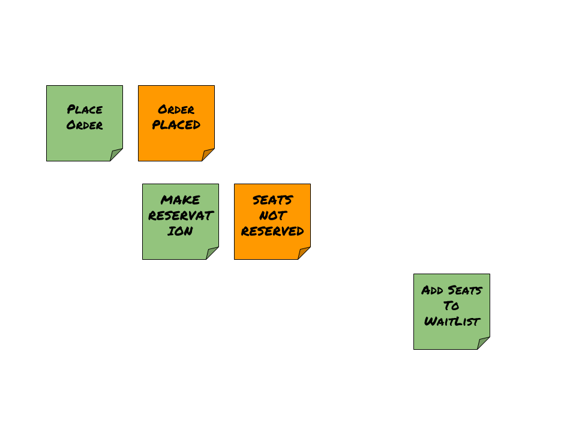

# prooph-saga-playground

       

Small CLI application to introduce Saga pattern. It reflects the business process of making a reservation. It uses message driven approach (see [ProcessManager](https://github.com/lzakrzewski/prooph-saga-playground#processmanager) section).
[Prooph/service-bus](https://github.com/prooph/service-bus) was used for handling messages (commands, domain events).    
 
Inspired by:
- **Modeling complex processes and time with Saga pattern** talk by [Mariusz Gil](https://twitter.com/mariuszgil) performed on [2017.phpce](https://2017.phpce.eu) conference
- [Saga on sagas](https://www.microsoft.com/en-us/download/details.aspx?id=34774) section from a book "Exploring CQRS and Event Sourcing"
- [broadway/broadway-saga](https://github.com/broadway/broadway-saga) nice repo with saga implementation

## Requirements
##### non-docker:
- PHP 7.1 or later, [composer](https://getcomposer.org/)   
##### docker:
- [Make](https://www.gnu.org/software/make/) and [Docker](https://www.docker.com)

## Installation (non-docker):
- `git clone git@github.com:lzakrzewski/prooph-saga-playground.git`
- `cd prooph-saga-playground && composer install`

## Usage
##### non-docker:
- `bin/console prooph:saga:playground`      
##### docker:
- `make playground` (with docker installation step might be skipped)

## Example output

## ProcessManager
It can handle two scenarios. When everything is fine then `OrderProcessManager` dispatches `OrderConfirmed` event and process ends. If there is not enough seats available then `OrderProcessManager` dispatches `AddSeatsToWaitList` command.    

##### happy-path:

##### unhappy-path:

